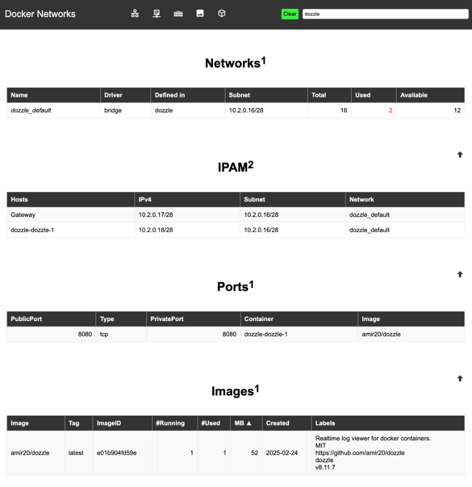

# docker-networks
* After a reboot of my docker server, I found out that docker assigned my static configured IP to another container and only 2 containers were up. That day I wished I had this tool...
* So, this is a docker container to show html tables with the docker network info.
* About 25MB / 10MB compressed

## Preview


## Features
* Displays
  * Networks
    * The basic overview of the pressent networks and their usage. 
  * IPAM
    * Filter on a network, and this will show all IP's.
    * 1 row per container per ip: a container with 2 interface will have 2 rows here.
  * Ports
    * What ports are being published
    * If the PublicPort is empty, this port is not published to the outside world.
    * 1 row per internal port: a container with 3 internal ports will have 3 rows here.
  * Images
    * Originally Images and Containers were not included, but it gives more context to the Ports section.
    * I like the 'sort by size' option while compairing possible new container/images
  * Containers
    * Most of the info is already found above, but this is nice way to jump from one one network to the other by clicking around: database -> webserver -> reverse-proxy...
* Usage
  * Click any table-cell, and this will become a search/grep/filter: only rows containg this text will remain and empty tables will be removed.
    * Click the green 'clear' button in the Nav bar and you have your default start view
  * Click the 'Docker Networks' title on the top left to refresh the json info
    * As long if you don't do this all grep/filters are done with the same data

## Links
* https://github.com/BartVanEynde/docker-networks⁠/
* https://hub.docker.com/r/bartvaneynde/docker-networks
  * Have a look at the 'dev' branch and build your own container if you are not using 'amd64'
* https://hub.docker.com/r/sebp/lighttpd <-- based on this image
  
## A possible compose.yml file
```
services:
  docker-networks:
    image: bartvaneynde/docker-networks
    container_name: docker-networks
    volumes:
      - /var/run/docker.sock:/var/run/docker.sock
    ports:
      - 6687:80    # If you want to access it via http directly
    networks:
      - revproxy-net
    # command: chown lighttpd:lighttpd /var/run/docker.sock
    tty: true
networks:
  revproxy-net:
    external: true  # this network is defined in my reverse-proxy container and gives me https
```

## whishlist
* IPv6
* darkmode/lightmode
* improve the javascript (numeric) search

